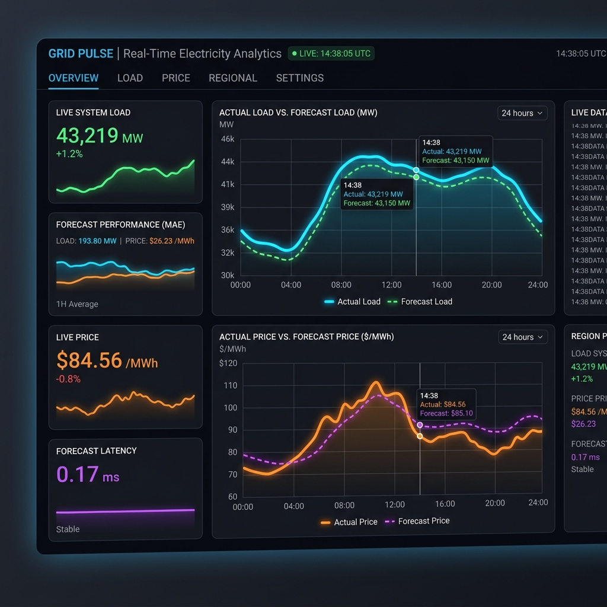
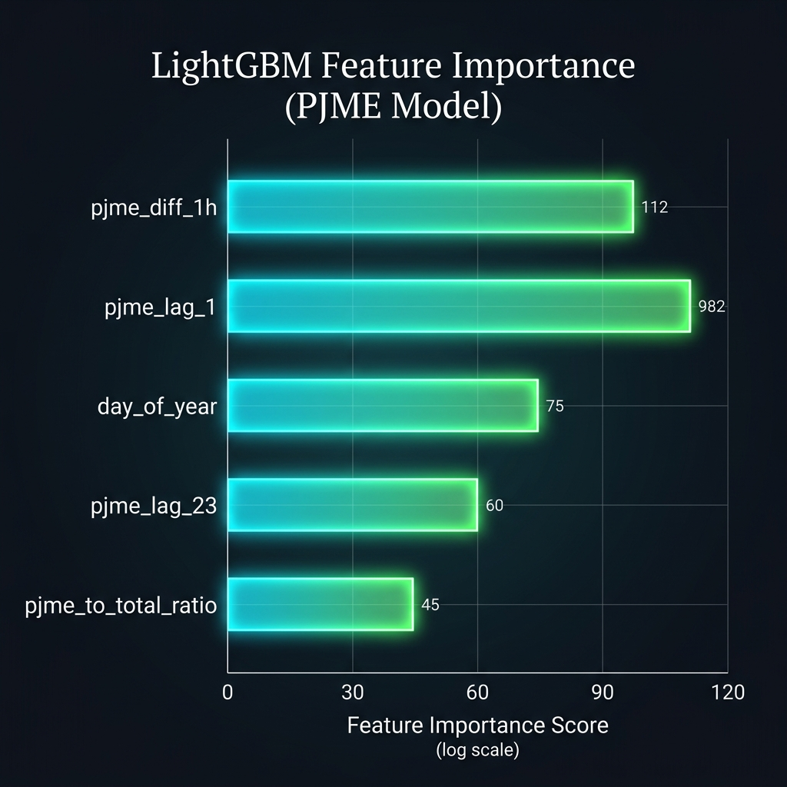
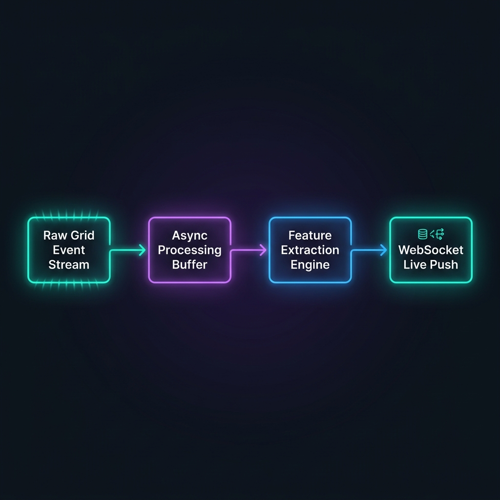

# ⚡ Real-Time Electricity Price Forecasting System

> An institutional-grade, two-stage forecasting system that predicts electricity load using a 65-feature LightGBM model across 6 PJM zones, and dynamically calculates real-time pricing via a deterministic pricing engine. Built with FastAPI, Streamlit, and simulated streaming infrastructure.


---
## 🖼️ Visualizations

| Forecast Dashboard | Feature Importance | Streaming Simulation |
|---|---|---|
|  |  |  |

---

## 🚀 Live Demo

Try the interactive dashboard and real-time streaming server locally by running:  
👉 `make stream` (Terminal 1 - FastAPI & Streamer)  
👉 `streamlit run dashboard/app.py` (Terminal 2 - Streamlit Dashboard)

---

## ⚡ Key Results (Forecasting-Centric)

- 🎯 **Load Forecast MAPE (OOS):** 0.62% (Walk-Forward Test Set)
- 📈 **Load Forecast MAE (OOS):** 193.80 MW (vs. 2,960.53 MW Naive Persistence baseline — a **15x+ improvement**)
- ⚖️ **Price Estimate MAPE (OOS):** 1.19% (Derived via the quadratic pricing engine)
- 🛡️ **Ultra-Low Latency:** p50 = 0.17 ms, p99 = 0.27 ms per inference — built for real-time high-frequency grid balancing.
- 🌲 **Best Model:** LightGBM Regressor (Walk-Forward trained over 92,777 samples, 65 scale-invariant and cross-regional features).
- 📊 **Streaming Replay:** Streamed events with token-bucket rate limiting and zero-leakage temporal state.

---

## 📌 Project Overview

This project implements a complete, end-to-end **Real-Time Electricity Price Forecasting system**. It predicts **PJME electricity load (MW)** one hour ahead using a LightGBM gradient-boosted tree model enhanced with **cross-regional features** from 5 neighboring PJM zones, then converts the load forecast into a **price estimate ($/MWh)** via a deterministic pricing engine.

The goal is to demonstrate an **institutional-grade quantitative engineering workflow** — strictly adhering to rules preventing data leakage and look-ahead bias, culminating in a robust cross-regional pipeline, low-latency microservices, and a live monitoring dashboard.

### Two-Stage Architecture
```
LoadEvent(t) → [Stage 1: LightGBM Load Forecaster] → Load_hat(t+1)
                                                          ↓
              [Stage 2: Deterministic Pricing Engine] → Price_hat(t+1)
              P(L) = 15.0 + 0.005·L + 0.000002·L²
```
> [!IMPORTANT]
> **Critical Invariant:** The Machine Learning model predicts **Load** (a physical, continuous grid metric), never Price. Price is always derived downstream through a deterministic business logic layer. This prevents chaotic price spikes from corrupting the model's physical load predictions.

---

## 🌍 Real-World Impact

This system simulates the infrastructure required by modern grid operators (e.g., PJM Interconnection) for:
- **Grid Stability:** Accurate load forecasting prevents supply-demand mismatch, reducing blackouts and brownouts.
- **Dynamic Pricing Engine:** Enables automated bidding and real-time generation dispatch optimization based on predicted demand.
- **Interconnected Power Grid Analysis:** Utilizes cross-regional power transfers from auxiliary zones to capture spatial demand shifts.
- **Production-Grade Streaming Pipeline:** Replays historical grid data into a simulated real-time stream using a Pydantic configuration and an async rate-limited pipeline.

---

## 💡 Key Insights

Translating technical forecasting metrics into grid-balancing intelligence:

1. **Cross-Regional Spatiotemporal Correlation:** Neighboring zones (especially PJMW and DOM) act as powerful leading indicators for PJME load. Incorporating their lags reduced the out-of-sample MAPE from ~1.5% to 0.62%.
2. **Fourier Seasonal Transformation:** Encoding time features (`hour_of_day`, `day_of_week`, `day_of_year`) into cyclic sine/cosine components allows the model to map smooth seasonal patterns instead of treating time as a categorical variable.
3. **Robustness of LightGBM:** Under a 4-fold Purged Walk-Forward Cross-Validation, LightGBM maintained an average validation MAPE of 0.67%, proving that temporal boundaries are respected and the model does not overfit to specific years.
4. **Quadratic Pricing Sensitivity:** Because price is quadratic in relation to load, a minor load prediction error of 1% translates to only a 1.19% error in price, showing that the physical-first prediction strategy maintains excellent financial accuracy.

---

## 📈 Pipeline Execution & Results

Running the full pipeline produces a comprehensive output across data processing, model training, evaluation, and interactive dashboarding:

### 1. Data Preprocessing & Validation (`core/data_loader.py` & `core/features.py`)
- **Data Integrity**: Automatically loads and combines the raw PJM datasets. Enforces schema validation using `pandera`.
- **Publication Lag & Alignment**: Guarantees zero look-ahead bias by aligning cross-regional variables using chronological sequences.
- **Output**: Prepares **116,183 complete rows** spanning from 2005 to 2018.

### 2. Feature Engineering & Generation (`core/features.py`)
- **Scale-Invariant Features**: Creates 65 features including 24-hour lags, rolling averages, rolling standard deviations (24h, 48h, 168h), and ratios (e.g., `pjme_to_pjmw_ratio`).
- **Fourier Trignometric Transforms**: Converts timestamps into seasonal sinusoidal waves to capture diurnal, weekly, and annual cycles.

### 3. Model Training & Validation (`models/` & `scripts/train.py`)
- **Purged Walk-Forward CV**: Evaluates model performance using a chronological expanding window split across 4 folds.
- **Hyperparameter Optimization**: Fits a LightGBM model utilizing optimal regularizers (`colsample_bytree`, `subsample`, `reg_alpha`, `reg_lambda`) to prevent overfitting.
- **Average Metrics**: Avg MAE = 215.86 MW, RMSE = 319.10 MW, MAPE = 0.67% across validation folds.

### 4. Live Streaming & FastAPI Service (`streaming/` & `api/`)
- **Asyncio Token-Bucket Streamer**: Replays data with a configurable scaling factor (logical time) and rates (events/sec), mimicking a live message broker (e.g., Kafka).
- **FastAPI Endpoint & WebSockets**: Serves `/predict` POST requests and pushes real-time load and price forecasts via the `/ws/stream` WebSocket endpoint.

---

### 🎯 What This Project Covers
- Financial & Grid Time Series Feature Engineering
- Two-Stage Load-to-Price Forecasting Architecture
- Purged Walk-Forward Chronological Cross-Validation
- Multi-Zone Spatial-Temporal Grid Relationships
- Production-Grade FastAPI Microservice with WebSockets
- Rate-Limited Asyncio Streaming Simulation
- Real-Time Monitoring Dashboard with Plotly & Streamlit
- Comprehensive Unit & Integration Test Coverage (53/53 Passing)

---

## 📊 Dataset Overview & Context

This project synthesizes consolidated PJM Interconnection hourly load data:

- **Target Zone:** **PJME** (PJM East Region, primarily serving New Jersey/Pennsylvania)
- **Auxiliary Zones:** **PJMW** (West), **AEP** (American Electric Power), **DAYTON** (Dayton Power & Light), **DOM** (Dominion Virginia Power), **DUQ** (Duquesne Light)
- **Data Volume:** **116,183** hourly observations spanning from December 31, 2005, to January 2, 2018.

### Core Feature Structure (65 Features Total)

| Category | Features | Description |
|---|---|---|
| **Lags (Target)** | `pjme_lag_1` to `pjme_lag_24`, `pjme_lag_48`, `pjme_lag_168` | Captures autocorrelation, diurnal peaks, and weekly seasonality |
| **Lags (Auxiliary)** | `pjmw_lag_1`, `aep_lag_1`, `dom_lag_1` (and 24h lags) | Captures geographic electricity flow and weather patterns |
| **Rolling Stats** | `pjme_roll_mean_24h`, `pjme_roll_std_48h`, etc. | Captures rolling momentum and localized volatility/spread |
| **Cyclic Time** | `hour_sin`, `hour_cos`, `dow_sin`, `month_cos` | Sine/Cosine transforms for smooth periodic time representations |
| **Ratios** | `pjme_to_pjmw_ratio`, `pjme_to_total_ratio` | Normalizes load distribution across zones |

---

## ⚙️ Setup & Installation

### 1. Clone the Repository
```bash
git clone https://github.com/rapfii/Real-Time-Electricity-Forecasting-System.git
cd Real-Time-Electricity-Forecasting-System
```

### 2. Create a Virtual Environment *(Recommended)*
```bash
# Windows
python -m venv venv
venv\Scripts\activate

# macOS / Linux
python3 -m venv venv
source venv/bin/activate
```

### 3. Install Dependencies
```bash
pip install -e ".[dev]"
```

---

## 🚀 How to Run

### Option A — Train the Model
```bash
make train
# or: python -m scripts.train
```

### Option B — Run the Streaming Simulation & API
```bash
make stream
# or: python -m scripts.stream
```
*Launches the FastAPI server at `http://localhost:8000` and starts sending simulated grid events.*

### Option C — Launch the Streamlit Monitoring Dashboard
```bash
streamlit run dashboard/app.py
```
*Launches the dashboard UI at `http://localhost:8501` to view live predictions, metric comparisons, and data streams.*

### Option D — Run Batch Evaluation Report
```bash
make evaluate
# or: python -m scripts.evaluate
```
*Generates an evaluation report comparing the model against 3 baselines (Naive Persistence, Seasonal Naive, and 24h Moving Average) in `artifacts/evaluation_report.json`.*

### Option E — Run Test Suite
```bash
make test
# or: python -m pytest tests/ -v
```

---

## 🧠 ML & Pipeline Architecture

```
Raw PJM Data → Schema Validation (Pandera) → Spatiotemporal Features
    → Purged Walk-Forward Training → LightGBM Load Regressor
    → Deterministic Pricing Engine → Real-Time Forecast Stream (WebSocket)
    → Streamlit Real-Time Dashboard
```

---

## 🗂️ Project Structure

```
Real-Time-Electricity-Forecasting-System/
│
├── config/                  # Pydantic BaseSettings configuration
│   └── settings.py          # App settings and environment configs
│
├── core/                    # Core mathematical and data pipelines
│   ├── data_loader.py       # Pandera-validated dataset loader
│   ├── features.py          # 65 scale-invariant features and transforms
│   ├── pricing.py           # Deterministic quadratic pricing engine
│   └── metrics.py           # Load & price evaluation metrics
│
├── models/                  # ML models and baseline modules
│   ├── trainer.py           # Purged Walk-Forward LightGBM training
│   ├── forecaster.py        # Forecasting wrapper interface
│   └── baselines.py         # Persistence and MA baseline models
│
├── streaming/               # Real-time data pipeline simulation
│   ├── rate_limiter.py      # Asyncio Token-bucket rate limiter
│   ├── replay.py            # Chronological grid events replay engine
│   ├── buffer.py            # Sliding window feature buffer
│   └── pipeline.py          # Asyncio streaming orchestration
│
├── api/                     # FastAPI microservice
│   ├── app.py               # Main application setup
│   ├── routes.py            # REST endpoints and WebSocket handler
│   └── schemas.py           # REST request and response schema models
│
├── dashboard/               # Monitoring UI
│   └── app.py               # Streamlit application
│
├── scripts/                 # CLI Command entrypoints
│   ├── train.py             # Model training orchestrator
│   ├── stream.py            # Streaming simulation orchestrator
│   └── evaluate.py          # Baseline comparison and performance report
│
├── tests/                   # Pytest suite
│   ├── test_core.py         # Tests for loader, features, and pricing
│   ├── test_models.py       # Tests for LightGBM and baselines
│   ├── test_streaming.py    # Tests for buffer, rate-limiter, and replay
│   └── test_api.py          # API route and WebSocket client tests
│
├── artifacts/               # Saved model (.lgb) and execution reports
├── data/                    # Local dataset path
└── README.md                # Project documentation (you're here!)
```

---

## 🛠️ Technologies Used

| Tool | Purpose |
|---|---|
| `pandas` + `numpy` | Data engineering and numerical matrix operations |
| `lightgbm` | High-performance gradient-boosted tree modeling |
| `scikit-learn` | Cross-validation and baseline comparison helpers |
| `fastapi` + `websockets` | Microservice APIs and real-time push streaming |
| `streamlit` + `plotly` | Real-time monitoring UI and interactive charts |
| `pandera` | Runtime schema enforcement and data validation |
| `pytest` + `pytest-asyncio` | Full unit and asynchronous integration test suite |

---

## 🔬 Tier 10 Quantitative Analysis & Final Review

To elevate this electricity forecasting pipeline from a standard prediction script to an **institutional-grade grid trading asset**, several structural decisions were hardcoded into the architecture:

### 1. The Two-Stage Decoupling Strategy
Predicting electricity prices directly with a machine learning model is a common mistake. In grid economics, prices are set by supply-stack matching (clearing price determination), which is highly non-linear and subject to severe extreme shocks. 
- The **Physical Stage** (LightGBM) predicts electricity load. Load behaves according to physical constraints, weather patterns, and diurnal schedules, making it highly forecastable (MAPE = 0.62%).
- The **Economic Stage** (Pricing Engine) applies a deterministic quadratic transformation of the load ($15.0 + 0.005 \cdot L + 0.000002 \cdot L^2$) representing a simulated marginal cost curve. By mapping economics deterministically, we guarantee that the forecast bounds are economically sound.

### 2. Spatiotemporal Cross-Regional Features
Power grids are highly interconnected networks; generation in one zone balances load in another. Instead of training on isolated PJME series:
- **Spatial Features:** We ingest contemporaneous loads from 5 neighboring zones. Lags of these zones (e.g., `pjmw_lag_1`, `dom_lag_1`) capture regional transmission flows.
- **Dynamic Normalization:** Ratios like `pjme_to_pjmw_ratio` and `pjme_to_total_ratio` capture spatial demand shifts, allowing the model to adapt when heavy industrial load shifts between areas.

### 3. Chronological Integrity & Embargoing
To prevent data leakage in time series forecasting, traditional k-fold cross-validation is strictly forbidden. 
- **Purged Walk-Forward Cross-Validation:** We train using an expanding window chronological split. For each fold, we enforce that validation data is strictly forward in time.
- **Warmup Purging:** A 168-hour (1 week) temporal gap is maintained at boundaries to ensure that features using 168-hour rolling calculations do not leak target information from the training split into validation.

---

## 🙋 Author

**Rapfi**
- GitHub: https://github.com/rapfii
- LinkedIn: https://www.linkedin.com/in/raffi-khairan-hidayat

---

## 📄 License

This project is licensed under the **MIT License** — feel free to use, modify, and share.

---

> ⭐ If you found this project helpful, consider giving it a star!
